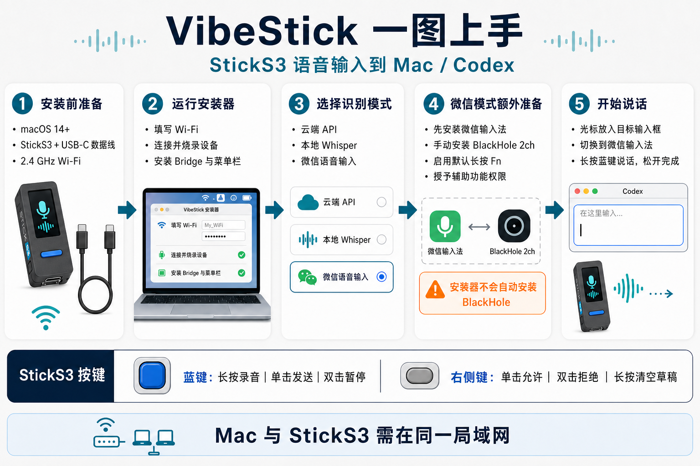

# VibeStick

[English](README.en.md)




VibeStick 把 M5Stack StickS3 变成一个 Codex 桌面终端：显示任务状态、运行中对话数量、当前用量窗口与重置倒计时，支持语音转写到 Mac，并可通过 BMI270 空间手势操作 Codex。

本项目面向 M5Stack StickS3，不是 M5Stack 官方项目。

## 快速安装

普通用户只需使用 macOS 安装器，无需手动配置 Python、ESP-IDF、串口、固件或 LaunchAgent。

准备：

- macOS 14 或更高版本。
- M5Stack StickS3 和 USB-C 数据线。
- 2.4 GHz Wi-Fi 名称和密码。
- 可选的语音转写 API Key；推荐 [SiliconFlow](https://cloud.siliconflow.cn)，也支持其他 OpenAI 兼容服务。

最新源码版本为 **v0.3.0**。已公开发布的安装包仍可从 [v0.1.7 Release](https://github.com/deanxizian/VibeStick/releases/tag/v0.1.7) 下载；需要空间手势、微信语音输入、离线 Whisper 和右键审批控制时，请从当前源码构建最新版安装器。安装器支持 Apple Silicon 和 Intel；尚未经过 Apple 公证，若首次打开被 macOS 阻止，请右键 App 后选择“打开”。

也可以从源码构建：

```sh
git clone https://github.com/deanxizian/VibeStick.git
cd VibeStick
./script/build_and_run.sh
```

安装器会自动打开，并保存在 `dist/VibeStickSetup.app`。之后可以直接打开这个 App，或将它移到“应用程序”。首次从源码构建需要 Xcode Command Line Tools；其余运行环境由安装器自动准备。

安装只有三步：

1. 填写 Wi-Fi、调节 StickS3 提醒音音量，并按需配置和检测语音 API。
2. 连接 StickS3，按界面提示进入安装模式。
3. 确认安装；客户端会自动准备组件、烧录固件、安装 Mac 服务并检查设备联网。

首次安装会下载约 1 GB 的 ESP-IDF。安装期间请保持 Mac 联网并且不要拔掉数据线。

## 使用

- 在 Mac 状态栏的“语音识别模式”中选择云端 API、本地 Whisper 或微信语音输入法；三种模式彼此独立保留。
- 长按正面蓝键说话，松开后完成当前模式的输入。微信模式会从按下时开始流式传输，并模拟微信输入法默认的长按 Fn，无需修改微信快捷键。
- 录音成功后的 30 秒内，单击蓝键发送当前草稿。
- 录音成功后的 30 秒内，双击蓝键暂停当前 Codex 任务。
- 单击右侧大矩形键切换到 Roxy 页面；有真实 Codex 授权框时同时“允许”。双击切回监控页；有授权框时同时“拒绝”。
- 语音文字粘贴错误时，长按右侧大矩形键约 0.7 秒，清空 Codex 输入框中的语音草稿。
- 在菜单栏启用“空间手势”后，同时按下正面蓝键和右侧大矩形键启动识别窗口；设备会播放提示音并持续显示“识别中”。
- 识别窗口内敲击 S3 两次可切换 Codex 规划模式，敲击三次可切换快速模式，连续摇晃可新建任务。三个动作均可在“空间手势设置…”中改为其他 macOS 快捷键或单独禁用。
- 提醒音音量可在安装器中按 0–100% 调节；重新安装并烧录后生效。
- 修改 Wi-Fi、提醒音音量、语音配置或重新烧录时，再次打开最新版安装器并重新安装。Mac 软件安装和固件刷新都以安装器为唯一正式交付路径。

Bridge 和 HUD 会随当前用户登录自动启动。Mac 与 StickS3 需要连接同一局域网。

## 空间手势

空间手势默认关闭，需从 Mac 菜单栏手动启用。为避免放在口袋里走动时误触，BMI270 不会持续识别动作：只有同时按下前键和侧键后才打开一次可配置的 3–6 秒识别窗口，并且每个窗口最多执行一个动作。

| 动作 | 默认 Codex 操作 | 默认 macOS 快捷键 |
| --- | --- | --- |
| 敲击 S3 两次 | 切换规划模式 | `Control+Shift+1` |
| 敲击 S3 三次 | 切换快速模式 | `Control+Shift+@` |
| 连续摇晃 S3 | 新建任务 | `Command+N` |

前两项默认值来自本机 `~/.codex/keybindings.json`。设置窗口支持 `default`、`disabled`，以及由 `command`、`control`、`option`、`shift` 组成的自定义 macOS 快捷键。

节能方面，待机时 BMI270 的加速度计和陀螺仪均关闭。组合键启动窗口后，固件只开启 100 Hz 加速度计；识别成功、窗口超时、开始录音或关闭空间手势时立即关闭。当前三个动作均不需要陀螺仪。

## 常见问题

- **检测不到设备**：确认使用 USB-C 数据线而不是仅充电线，重新插拔并按安装器提示进入安装模式。
- **无法连接 Wi-Fi**：StickS3 只支持 2.4 GHz Wi-Fi。
- **语音 API 检测失败**：检查 API 地址、Key、模型和当前网络。
- **能转写但没有粘贴**：在“系统设置 → 隐私与安全性”中允许麦克风和辅助功能权限。
- **微信面板没有出现**：先将微信输入法设为当前输入源，把光标留在目标输入框，并确认已安装 `BlackHole 2ch`；详见[微信语音输入说明](docs/WECHAT_INPUT.md)。
- **S3 显示等待授权但 Codex 没弹窗**：确认 Mac 与固件都由同一个最新版安装器安装；自动审批不会触发等待授权状态或提示音。
- **空间手势没有反应**：先确认菜单栏中的空间手势已开启，再同时按下前键和侧键；听到提示音并看到“识别中”后再完成动作。
- **空间手势设置无法打开**：确认菜单栏程序来自最新版安装器；设置窗口会在菜单关闭后自动前置显示。
- **安装中断或失败**：保持数据线连接，重新打开安装器安装即可。

## 卸载 Mac 服务

```sh
./scripts/uninstall.sh
```

加上 `--purge` 会同时删除 `~/Library/Application Support/VibeStick/` 中的配置、日志和运行数据。

## 开发者文档

- [macOS 安装器构建、测试与打包](app/macos/README.md)
- [硬件与固件](docs/HARDWARE.md)
- [架构](docs/ARCHITECTURE.md) 与 [通信协议](docs/PROTOCOL.md)
- [微信输入法语音输入 MVP](docs/WECHAT_INPUT.md)
- [环境变量示例](.env.example)
- [贡献指南](CONTRIBUTING.md) 与 [安全报告](SECURITY.md)

请勿提交真实 API Key、Wi-Fi 密码、本地 token、录音或日志。

## 当前限制

- 仅支持 M5Stack StickS3 和 macOS 14 或更高版本。
- 安装器尚未作为经过公证的 DMG 发布。
- StickS3 与 Bridge 使用明文 HTTP，请仅在可信局域网使用，不要将端口 `8765` 暴露到互联网。
- Codex 用量来自本机 session 数据，并非官方 quota API。
- 使用云端语音服务时，录音会离开本机 Mac。

## 许可证

VibeStick 使用 [MIT License](LICENSE)。

Roxy 是为本项目创建的 Codex 自定义宠物。仓库与安装器只包含针对 StickS3 生成并压缩的固件资源，不包含本机 Codex 原始图集。
