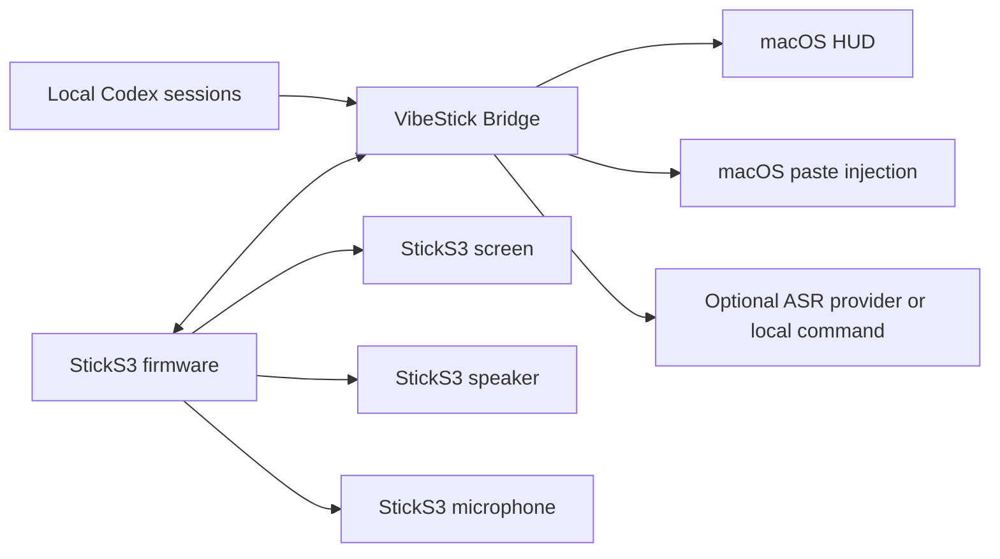

# VibeStick Architecture

VibeStick has two active runtime parts:

1. StickS3 firmware.
2. Local Mac bridge service.

The StickS3 does not call cloud AI services directly. It polls and posts to the Mac bridge over HTTP on the local network.



## StickS3 Firmware

Firmware lives in `firmware/sticks3/`.

It owns:

- Screen rendering with LVGL.
- Wi-Fi connection.
- Polling `GET /state`.
- Posting button events to `/event`.
- Blue front-button controls: long press records push-to-talk audio; for 30 seconds after a successful recording, single click sends Return and double click stops the current Codex turn. Clicks outside that window are ignored by both firmware and Bridge.
- Right-side `KEY2` control: GPIO 12 single click switches locally between the dashboard and Roxy pet view without posting a Bridge event.
- Roxy animation selection from the same Codex state used by the dashboard: idle/offline, running, approval, done, and error.
- 16 kHz / 16-bit / mono PCM recording from the StickS3 microphone.
- Uploading PCM to `/recording/audio`.
- Agent status sounds generated as PCM and played through ES8311/I2S speaker output.
- Local battery and USB power display from the StickS3 PMIC.

It does not read account cookies, browser state, API keys, or quota dashboards.

## Mac Bridge

Bridge code lives in `bridge/src/vibe_stick/`.

It owns:

- HTTP API for the StickS3.
- Local Codex status and quota observation from `~/.codex/sessions/**/*.jsonl`.
- Recording session state.
- Optional ASR via a local command or an OpenAI-compatible API.
- Transcript paste injection into the active macOS app.
- Return-key injection for sending a draft and Codex-targeted Escape injection for stopping the current turn, gated by the 30-second post-recording action window.
- HUD state file updates for recording status.

Bridge state is stored under:

```text
~/Library/Application Support/VibeStick/
```

## Transport

v0.1.7 uses HTTP over Wi-Fi.

BLE is not part of the current mainline transport. USB is used for flashing and serial logs, not for runtime state transport.

HTTP traffic is not encrypted. The shared token authorizes protected requests but can be captured and replayed by an observer on the same network. The supported deployment boundary is a private, trusted LAN with port `8765` blocked from the internet.

## State Flow

1. The StickS3 polls `GET /state` every 2 seconds.
2. The Bridge builds a local `VibeStickState`.
3. The StickS3 parses Codex status, quota fields, and alert fields.
4. The StickS3 updates both the dashboard widgets and the Roxy animation; `KEY2` chooses which view is visible.
5. Alert sounds are triggered only on relevant alert state changes, not on every poll.

## Recording Flow

1. User long-presses the blue front button.
2. Firmware starts StickS3 microphone recording and posts `/recording/start`.
3. Firmware shows a full-screen listening overlay.
4. User releases the button.
5. Firmware stops recording, uploads PCM to `/recording/audio`, then posts `/recording/stop`.
6. Bridge writes a local WAV file, runs ASR, and pastes the transcript when successful.
7. Recording start and stop do not play agent alert sounds.

## Status And Quota

Codex status is inferred from local Codex process/session activity and recent session event payloads. Quota is inferred from `token_count` events containing `rate_limits`. The display follows the reported window dynamically: a single weekly window is shown as remaining usage plus reset countdown, while legacy dual 5-hour/7-day windows remain supported. This is a local observation strategy, not an official quota API.

Codex observation covers all user-started root conversations visible in local session data. Background subagents are excluded. A completion in any root conversation can publish an alert even while another conversation keeps the aggregate screen status at `RUNNING`.

The StickS3 home screen is dedicated to Codex status and quota.

## v0.1.7 Limits

- No Apple-notarized DMG; the release provides a signed universal App in a ZIP archive.
- No signed firmware release artifact.
- No general device abstraction beyond StickS3.
- No official Codex API for quota.
- No BLE runtime transport.
